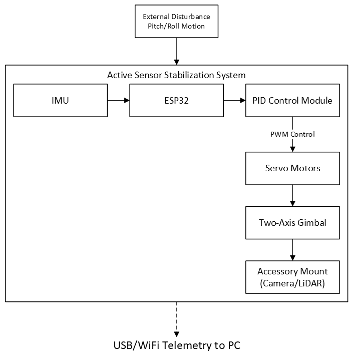

# System Architecture

**Project:** Active Sensor Stabilization Platform (ASSP)

**Project Number:** OD-001

**Revision:** Rev A

**Status:** Draft

**Author:** Jacob Crihfield

---

# 1. Overview

The Active Sensor Stabilization Platform is an embedded electromechanical control system designed to maintain payload orientation despite external platform disturbances.

The system consists of five primary subsystems:

- Mechanical
- Electrical
- Embedded Control
- Sensors
- Software

---

# 2. High-Level System Architecture

*Figure 2-1. High-Level System Architecture*

---

# 3. Mechanical Subsystem

Responsibilities

- Support payload
- Rotate pitch axis
- Rotate roll axis
- Maintain structural rigidity
- Minimize backlash

Components

- Base
- Roll frame
- Pitch frame
- Bearings
- Servo mounts
- Payload mount

---

# 4. Electrical Subsystem

Responsibilities

- Distribute power
- Protect electronics
- Provide regulated voltages

Major Components

- 12V Supply
- Buck Converter
- ESP32
- IMU
- Servos
- Switch
- Fuse

---

# 5. Embedded Control Subsystem

Responsibilities

- Read IMU
- Calculate attitude
- Execute PID loop
- Generate PWM
- Output telemetry

---

# 6. Software Architecture

Main Tasks

- Initialization
- Sensor Calibration
- Sensor Reading
- PID Calculation
- Servo Control
- Telemetry
- Fault Detection

---

# 7. Communications

| Interface | Protocol |
|------------|----------|
| ESP32 ↔ IMU | I²C |
| ESP32 ↔ Servos | PWM |
| ESP32 ↔ PC | USB Serial |

Future Interfaces

- CAN
- Ethernet
- Wi-Fi
- Bluetooth

---

# 8. Power Architecture

12V Input
↓
Buck Converter
↓
5V Rail
↓
ESP32
↓
IMU
↓
Servos

---

# 9. System States

BOOT
↓
INITIALIZATION
↓
CALIBRATION
↓
READY
↓
ACTIVE CONTROL
↓
FAULT
↓
SHUTDOWN